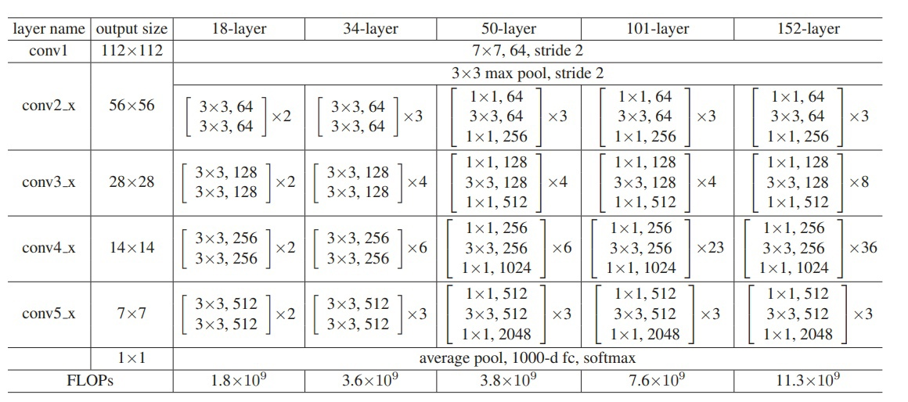
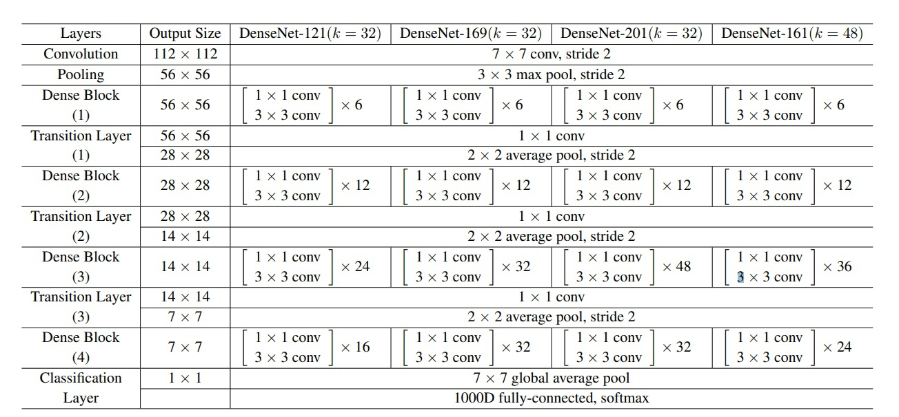

# carbs-count

## Данные

- [Nutrition5k](https://github.com/google-research-datasets/Nutrition5k)

## Модели

### ResNet

### DenseNet

## Результаты
|                              **Модель**                              | **MAE**  | **MSE** | **RMSE** |  
|:--------------------------------------------------------------------:|:--------:|:-------:|:--------:|
| baseline   среднее значение по тренировочному датасету |  13.67   | 303.94  |  15.79   | 
|            resnet152   без карт глубины                |  `7.18`  | 125.30  |  10.53   |
|           `resnet152`   с картами глубины              | `6.13`   |  92.51  |   9.24   | 
|             resnet50   без карт глубины                |   7.47   | 136.60  |  11.17   |
|            resnet50   с картами глубины                |   6.32   |  91.31  |   9.31   | 
|           densenet121   без карт глубины               |   7.35   | 115.40  |  10.46   |
|           densenet121   с картами глубины              |   6.24   |  92.44  |   9.38   | 
|           densenet201   без карт глубины               |   7.46   | 138.10  |  11.33   |
|           densenet201   с картами глубины              |   6.17   |  94.04  |   9.36   | 
			
	